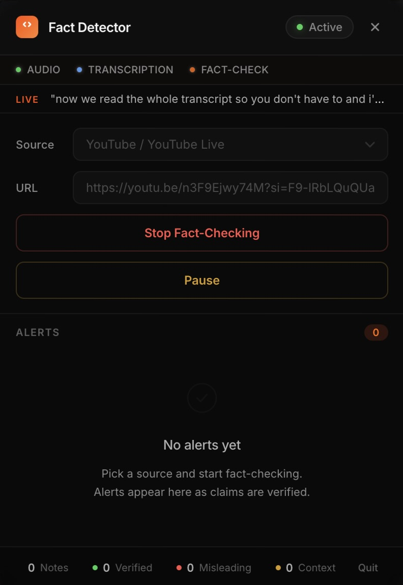
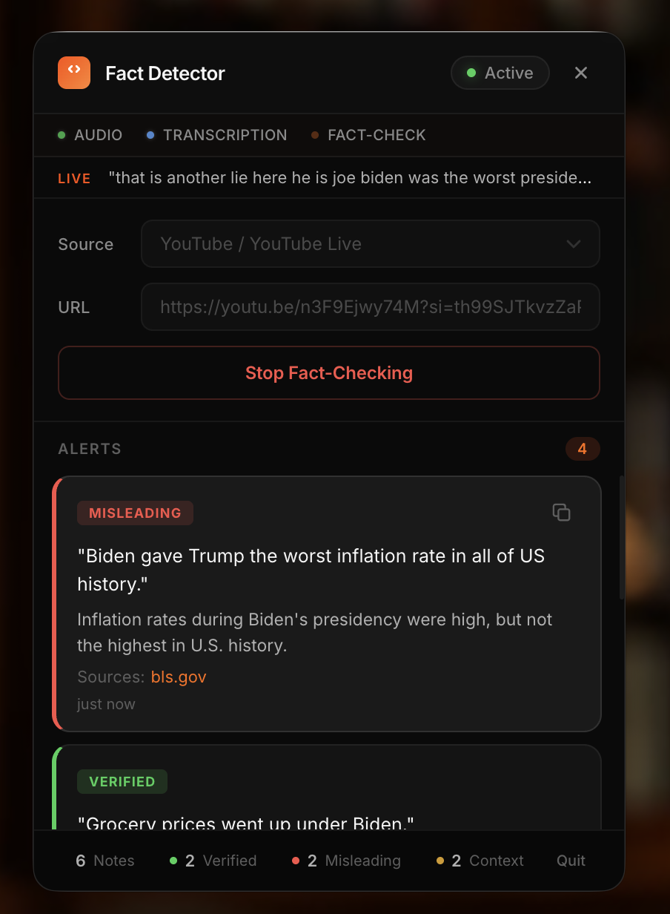

# Fact Checker

Real-time fact-checking powered by [VideoDB Capture](https://github.com/video-db/videodb-capture-quickstart) and [Gemini AI](https://ai.google.dev/gemini-api/docs/libraries).

Play a YouTube video, join a Google Meet, or stream a podcast — Fact Checker captures the audio, transcribes it live, and generates community-style notes on every factual claim it hears.

---

## Quick Start

Three commands — the setup script handles everything else (Node.js, Python, dependencies).

### 1. Clone and navigate

```bash
git clone https://github.com/video-db/fact-checker.git
cd fact-checker
```

### 2. Run setup

```bash
./scripts/setup.sh
```

This will:
- Check for Python 3.12+ and Node.js 18+ (installs via Homebrew on macOS if missing)
- Install [uv](https://github.com/astral-sh/uv) for fast Python package management
- Prompt for your **VideoDB** and **Gemini** API keys (both free)
- Install all Node.js and Python dependencies
- Create a Python virtual environment

> **Get your API keys:**
> - VideoDB — free at [console.videodb.io](https://console.videodb.io)
> - Gemini — free at [aistudio.google.com/apikey](https://aistudio.google.com/apikey)

### 3. Start the app

```bash
./scripts/start.sh
```

A magnifying glass icon appears in your menu bar. Click it to open the popup.

### 4. Grant macOS permissions (first launch only)

- **Microphone** — a macOS dialog will appear; click **Allow**
- **Screen Recording** — must be granted manually:
  1. Open **System Settings → Privacy & Security → Screen & System Audio Recording**
  2. Click **+**, press **Cmd+Shift+G**, and paste:
     ```
     node_modules/electron/dist/Electron.app
     ```
  3. Toggle it **on** and restart the app

### 5. Start fact-checking

1. Pick a source — YouTube, Google Meet, local file, or live stream
2. Paste the URL
3. Click **Start Fact-Checking**
4. Play the video/audio — **make sure it is not muted**

Alerts appear after 30–60 seconds. The tray icon turns orange while actively fact-checking.

### 6. Stop

Click **Stop** in the popup. To quit entirely, click **X** or **Quit**.

---

## How It Works

```
Audio Source (YouTube, Meet, podcast, etc.)
    ↓
VideoDB Capture (records system audio)
    ↓
Real-time Transcription (WebSocket)
    ↓
Transcript Buffer (~20 seconds of text)
    ↓
Gemini AI (extract claims → verify → score confidence)
    ↓
Alerts (tray app + terminal + log files)
```

Every 20 seconds, the system:
1. Collects transcribed text
2. Sends it to Gemini for fact-checking
3. Labels each claim as **Verified**, **Misleading**, or **Needs Context**
4. Surfaces high-confidence results

---

## Alert Types

| Color | Label | Meaning |
|-------|-------|---------|
| Green | **Verified** | Factually accurate |
| Red | **Misleading** | Contains inaccuracies |
| Orange | **Needs Context** | Partially true, missing important context |

---

## Screenshots

<p align="center">
  
  &nbsp;&nbsp;
  
</p>

<p align="center">
  <em>Left: App waiting to start &nbsp;|&nbsp; Right: Live fact-checking with community notes</em>
</p>

---

## Features

- **Menu bar app** — runs as a tray icon, no dock clutter
- **Activity indicators** — live status for audio capture, transcription, and fact-checking
- **Live transcript ticker** — latest transcribed text in real-time
- **Tray icon states** — orange when active, gray when idle
- **Copy to clipboard** — hover over any alert and click the copy icon
- **Stats footer** — running totals for verified, misleading, and needs-context notes
- **Auto-reconnect** — reconnects automatically if the connection drops
- **Session recovery** — reopen the popup anytime without losing your session

---

## Configuration

All settings go in `.env`. Only the API keys are required — everything else has sensible defaults.

| Setting | Default | Description |
|---------|---------|-------------|
| `VIDEO_DB_API_KEY` | *required* | Your VideoDB API key |
| `GEMINI_API_KEY` | *required* | Your Gemini API key |
| `PORT` | `5002` | Backend server port |
| `FACT_CHECK_INTERVAL` | `20` | Seconds between each fact-check cycle |
| `MIN_WORDS_FOR_CHECK` | `15` | Minimum words before triggering a check |
| `CONFIDENCE_THRESHOLD` | `high` | Minimum confidence level for alerts (`high`, `medium`, `low`) |
| `CONTEXT_WINDOW_WORDS` | `150` | Words of previous context carried forward |
| `ALERT_COOLDOWN_SECONDS` | `30` | Minimum gap between alerts for similar claims |

---

## Cleanup

Active VideoDB streams consume credits even after the app is closed. If you force-quit or your machine crashes, clean up manually:

```bash
# Kill the backend server
lsof -ti:5002 | xargs kill -9

# Stop active streams on VideoDB
cd backend
source venv/bin/activate
python cleanup.py --force
```

---

## Project Structure

```
fact-checker/
├── package.json               # Electron config (main: app/main.js)
├── entitlements.mac.plist     # macOS entitlements (audio, JIT, library validation)
├── .env.example               # API key template
├── scripts/
│   ├── setup.sh               # One-time setup (installs everything)
│   └── start.sh               # Launch the app
├── app/                       # Electron frontend
│   ├── main.js                # Main process: tray, window, permissions, process management
│   ├── preload.js             # Secure bridge between Electron and UI
│   ├── index.html             # Popup UI with permission flow
│   └── icons/                 # Tray and app icons
├── backend/                   # Python backend
│   ├── backend.py             # Flask server — sessions, transcription, fact-checking
│   ├── client.py              # Capture client — records system audio
│   ├── config.py              # Configuration settings
│   ├── cleanup.py             # Stop active streams and free port
│   ├── requirements.txt       # Python dependencies
│   ├── pipeline/
│   │   ├── __init__.py        # Orchestrator: preprocess → verify → generate → filter
│   │   ├── claim_detector.py  # Transcript cleaning, context window
│   │   ├── verifier.py        # Gemini API: extract and verify claims
│   │   ├── note_generator.py  # Format results as community notes
│   │   └── alert_manager.py   # Confidence filtering, dedup, throttling
│   └── amd_mx/                # Native recording binaries
└── resources/
    ├── icon.icns              # App icon (used by electron-builder)
    └── logo.jpeg
```

---

## Troubleshooting

<details>
<summary><strong>"No alerts yet" after starting</strong></summary>

This is normal for the first 30–60 seconds. The system needs time to:
- Start audio capture
- Accumulate enough transcript (at least 15 words)
- Send it to Gemini for analysis

Make sure your video is **actually playing with audio unmuted**.
</details>

<details>
<summary><strong>"Error: Invalid session" on startup</strong></summary>

Your VideoDB API key is expired or invalid. Get a fresh key from [console.videodb.io](https://console.videodb.io) and update `.env`:

```bash
nano .env
```
</details>

<details>
<summary><strong>Port 5002 is already in use</strong></summary>

A previous run left a process on the port. The start script cleans this up automatically, but you can also run:

```bash
lsof -ti:5002 | xargs kill -9
```
</details>

<details>
<summary><strong>No audio captured / No transcripts appearing</strong></summary>

- Grant **Microphone** permission — the app requests this automatically on startup
- Grant **Screen Recording** permission manually:
  1. System Settings → Privacy & Security → Screen & System Audio Recording
  2. Add `Electron.app` from `node_modules/electron/dist/`
  3. Toggle it on and **restart the app**
- Make sure the video/audio source is **playing and not muted**
- Check that system volume is not at zero
</details>

<details>
<summary><strong>macOS blocks the capture binary</strong></summary>

Find and unquarantine the binary:

```bash
cd backend
source venv/bin/activate
RECORDER=$(python -c "import videodb_capture_bin; print(videodb_capture_bin.get_binary_path())")
xattr -d com.apple.quarantine "$RECORDER"
```
</details>

<details>
<summary><strong>Backend won't start</strong></summary>

Make sure both API keys are set in `.env`:

```
VIDEO_DB_API_KEY=...
GEMINI_API_KEY=...
```

The backend exits immediately if either key is missing.
</details>

---

## Built With

- [VideoDB Capture](https://github.com/video-db/videodb-capture-quickstart) — System audio capture and real-time transcription
- [Gemini AI](https://ai.google.dev/gemini-api/docs/libraries) — Claim extraction, verification, and confidence scoring
- [Flask](https://flask.palletsprojects.com) — Backend server
- [Electron](https://www.electronjs.org) — Desktop tray app
- [pycloudflared](https://github.com/6abd/pycloudflared) — Webhook tunneling
